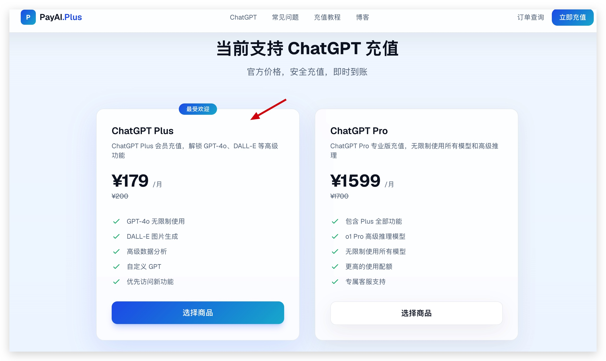
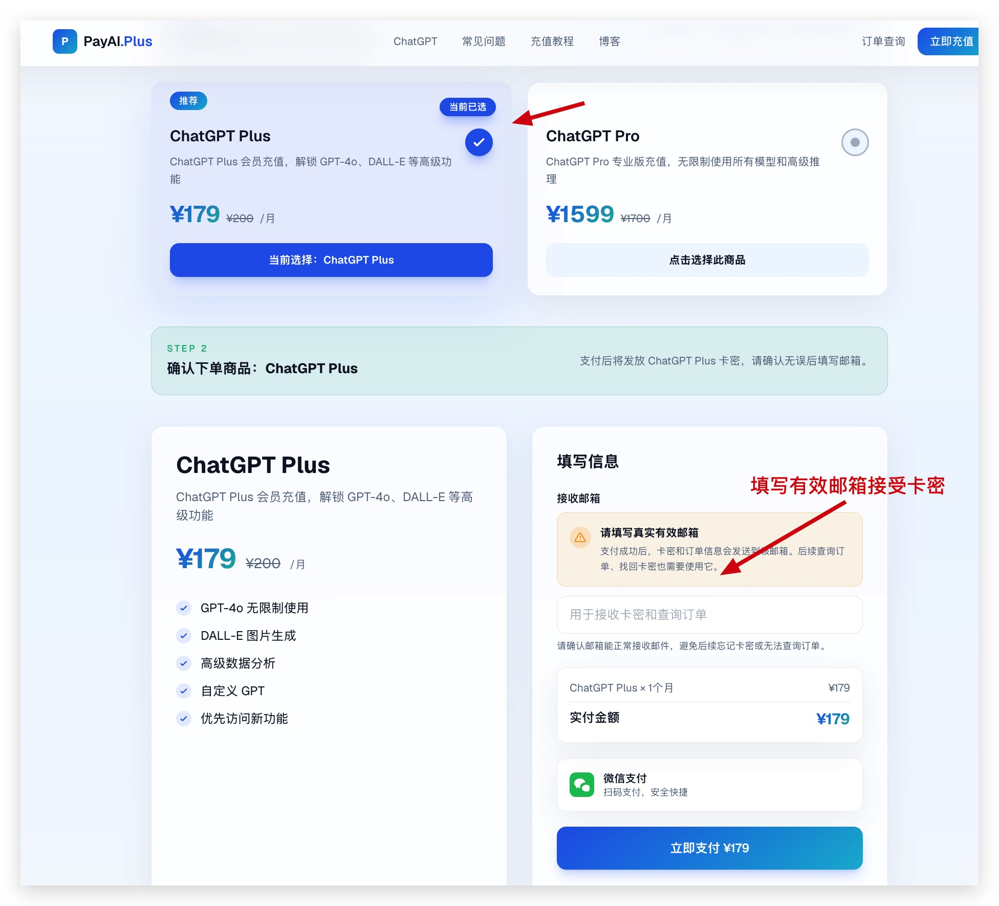
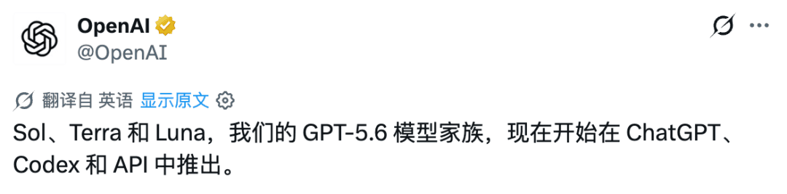
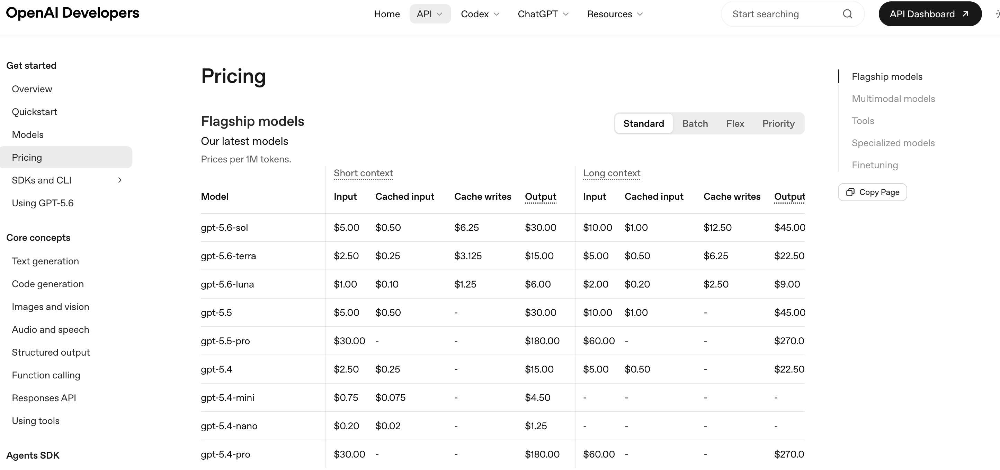
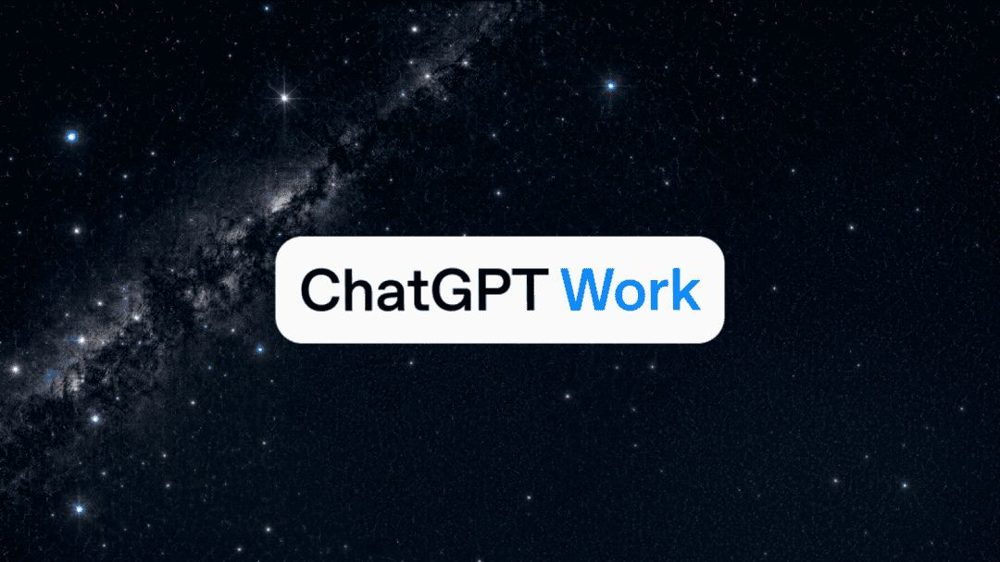

# 【亲测可用】ChatGPT 充值教程 2026：国内如何使用微信、支付宝充值 ChatGPT Plus、Pro、Codex？

> 本教程已经更新到 2026 年 7 月，记录的是我自己实际使用过的充值方法。

最近确实有很多人问我：国内没有海外信用卡，怎么充值 ChatGPT？ChatGPT Plus 能不能用支付宝或微信付款？想用 GPT-5.6 和 Codex，到底该怎么开通？

这些问题我自己也遇到过。国内银行卡付款经常失败，美区 Apple ID 和虚拟信用卡又比较折腾。后来我实际使用了 [PayAI.Plus](https://payai.plus/)，用人民币付款，拿到激活码后按照教程自己操作，整个过程比我之前折腾银行卡方便不少，也不用把 ChatGPT 账号密码交给别人。

如果你正在搜索下面这些问题，这篇文章可以直接给你答案：

- ChatGPT 充值
- 国内如何充值 ChatGPT
- ChatGPT Plus 充值教程
- 支付宝充值 ChatGPT
- 微信充值 ChatGPT
- ChatGPT Plus 代充
- ChatGPT 没有海外信用卡怎么付款
- ChatGPT 支付失败怎么办
- GPT-5.6 怎么开通

## 先说结论：我是怎么充值 ChatGPT 的

ChatGPT Plus 官方订阅价格目前为 **20 美元/月**。如果你有一张可以稳定完成境外订阅付款的银行卡，直接通过 ChatGPT 官方页面订阅通常最简单。

但我自己当时遇到的情况，也是很多国内用户会遇到的情况：没有稳定的海外信用卡、国内银行卡支付失败、不熟悉美区 Apple ID，也不想承担虚拟信用卡的开卡费和风控风险。

尝试和比较了几种方法后，我现在更愿意使用支持国内付款的充值平台。对我来说，省下来的不只是开卡费用，更多是反复研究卡段、账单地址和支付风控的时间。

我自己用的是：[PayAI.Plus](https://payai.plus/)

我用下来觉得比较方便的地方有这些：

- 官网当前展示微信扫码付款，其他人民币支付渠道以收银台为准；
- 按页面流程购买套餐、取得激活码并自行操作；
- 无需把 ChatGPT 账号密码直接交给代充人员；
- 页面提供操作指引，遇到问题可以联系网站客服；
- 不必自己研究海外信用卡、虚拟卡卡段或美区礼品卡。

> 以上是我使用时的体验。套餐价格、付款渠道、适用账号、激活条件和售后规则可能调整，大家购买前还是要以 [PayAI.Plus](https://payai.plus/) 页面展示及客服答复为准。

## 为什么国内充值 ChatGPT Plus 容易失败？

很多人已经注册好了 ChatGPT，真正被卡住的却是付款。

ChatGPT 官网主要面向支持地区提供服务，付款能否成功会受到发卡地区、卡组织、账单地址、支付通道和风控策略等多种因素影响。国内常见的银联单标卡、储蓄卡，以及部分国内发行的双币信用卡，并不一定能够稳定完成境外订阅。

支付宝和微信支付通常也不能直接出现在 ChatGPT 官网的银行卡付款页面。因此，“支付宝充值 ChatGPT”或“微信充值 ChatGPT”一般是指：先在支持人民币支付的第三方平台购买对应服务，再按照平台提供的流程完成激活，而不是直接向 OpenAI 官网扫码付款。

我最后选择 [PayAI.Plus](https://payai.plus/)，主要也是因为不想继续折腾支付工具。它把购买和激活步骤集中在一个比较清楚的流程里，对没有海外支付条件的人更容易上手。

## 我为什么会推荐 PayAI.Plus？

[PayAI.Plus](https://payai.plus/) 是一个面向国内用户的 AI 产品充值服务入口，可用于解决 ChatGPT Plus 等海外 AI 订阅的付款问题。它是独立第三方服务平台，并非 OpenAI 官方网站。

我一开始选择它的原因很简单：不需要先去办一张虚拟信用卡，也不用把 ChatGPT 账号和密码发给客服。付款后拿到卡密，再在自己的浏览器里按照教程完成操作，账号始终由自己保管。实际用过一次以后，我觉得这个方式确实比自己研究海外支付方便，所以后来再有人问我怎么充值 GPT，我一般都会把这个方法发给他。

如果你和我当时的情况差不多，这个方法会更合适：

- 没有海外 Visa、Mastercard 或 American Express 信用卡；
- 国内银行卡在 ChatGPT 付款页面反复被拒；
- 希望使用微信等熟悉的方式支付人民币，并在购买前确认实时可用渠道；
- 不想注册美区 Apple ID 或反复购买苹果礼品卡；
- 不熟悉虚拟信用卡，不想承担开卡、充值、冻结和卡段失效风险；
- 更看重操作简单，并希望遇到问题时能找到客服。

我比较看重的一点，是 PayAI.Plus 采用页面购买、获取激活信息、用户自行操作的方式。相比把邮箱、密码、验证码直接发给陌生人，这种流程能减少账号凭据暴露。

## PayAI.Plus 充值 ChatGPT Plus 操作步骤

下面是我使用时走过的流程，大家操作前也可以先看一遍：

**进入 PayAI.Plus → 选择 ChatGPT Plus 套餐 → 完成付款 → 获取激活码 → 按教程自行激活 → 检查订阅状态**

### 第一步：进入 PayAI.Plus

打开充值入口：

👉 **[https://payai.plus/](https://payai.plus/)**

请认准域名 `payai.plus`，不要通过来源不明的相似链接付款。

### 第二步：选择 ChatGPT Plus 套餐

查看商品说明，确认套餐类型、适用账号、操作条件、有效期和售后规则。已经处于 Plus 订阅期的账号，可能需要根据商品页面说明等待到期后再操作。

### 第三步：使用页面支持的方式付款

按照收银台提示完成人民币支付。实际支持的支付宝、微信或其他付款渠道，以当时页面显示为准。

### 第四步：获取激活码

付款完成后，根据订单页面获取激活码或相应的激活信息，并妥善保存订单号。

### 第五步：按照页面教程自行激活

在页面指定的激活入口输入激活码，按照提示完成操作。不要把 ChatGPT 密码、邮箱验证码、两步验证代码 发给任何人。

### 第六步：确认 ChatGPT Plus 是否开通

登录 ChatGPT，在头像菜单的 **Settings（设置）→ Account / Plan（账户 / 套餐）** 中查看当前订阅状态。不同版本的页面名称可能略有区别。

如果页面没有及时更新，先不要重复购买。保留订单号和操作截图，并联系 PayAI.Plus 客服核实。

## 开通 ChatGPT Plus 后可以获得什么？

ChatGPT Plus 是 ChatGPT 的个人付费订阅方案。根据 OpenAI 当前说明，Plus 用户可获得更高的模型使用额度、更快的响应，以及语音、图片生成、文件上传与分析、Deep Research、自定义 GPT 等扩展能力；具体功能、额度和可用地区可能动态调整。

2026 年 7 月，OpenAI 已推出 GPT-5.6 系列：

- **GPT-5.6 Sol**：旗舰能力档位，面向复杂推理、编程与专业任务；
- **GPT-5.6 Terra**：兼顾能力、速度与成本的均衡档位；
- **GPT-5.6 Luna**：更快、更经济，适合高频和轻量任务。

Plus 用户可在符合条件的 ChatGPT、Work 或 Codex 场景中使用相应的 GPT-5.6 能力，但不同模型是否可选、使用额度以及功能入口可能不同。请以账号内实际显示为准。

需要特别说明：**ChatGPT Plus 订阅不包含 OpenAI API 费用。** API 是单独的开发者服务，需要另行开通并按用量计费。

参考官方说明：

- [OpenAI：什么是 ChatGPT Plus](https://help.openai.com/en/articles/6950777-what-is-chatgpt-plus)
- [OpenAI：GPT-5.6 正式发布与可用范围](https://openai.com/index/gpt-5-6/)
- [OpenAI：GPT-5.6 在 ChatGPT 中的使用说明](https://help.openai.com/en/articles/20001354-gpt-56-in-chatgpt)

## 国内常见的 ChatGPT 充值方法对比

| 充值方式 | 适合谁 | 优点 | 需要注意 | 推荐程度 |
| --- | --- | --- | --- | --- |
| 海外信用卡官方直付 | 已有稳定海外卡的用户 | 官方路径直接，订阅管理方便 | 国内发行的卡可能被拒 | 有卡首选 |
| PayPal | 已绑定可用境外付款方式的用户 | 支付链路熟悉 | 没有可用卡时通常仍解决不了根本问题 | 可尝试 |
| 美区 App Store 礼品卡 | 熟悉 Apple ID 区域设置的苹果用户 | 通过 App Store 订阅 | 注册、余额、税费和续费较繁琐 | 可选 |
| Google Play | 熟悉 Google 服务的安卓用户 | 可通过应用商店订阅 | 账号地区和付款资料门槛较高 | 备选 |
| 虚拟信用卡 | 熟悉卡段与平台风险的用户 | 可以模拟境外卡支付 | 可能有开卡费、冻结、失效和余额风险 | 新手慎用 |
| PayAI.Plus 激活方式 | 没海外卡、希望人民币付款的国内用户 | 流程直观，无需研究境外支付工具 | 购买前需确认商品规则 | 我会优先考虑 |

我自己的建议是：

- **有稳定海外卡：**优先考虑 ChatGPT 官方订阅；
- **熟悉美区 Apple ID：**可以比较 App Store 礼品卡方案；
- **没有海外卡，也不想折腾：**可以和我一样，优先看看 [PayAI.Plus](https://payai.plus/)；
- **不熟悉虚拟卡：**不要拿重要账号和大额余额反复试错。

## ChatGPT 充值安全注意事项

无论选择哪种充值方式，都建议守住以下底线：

1. **不要把账号密码交给陌生人。** ChatGPT 对话中可能包含工作资料、文件和个人信息。
2. **不要提供邮箱验证码或两步验证代码。** 验证码相当于临时登录凭证。
3. **不要泄露 API Key。** API Key 与 Plus 订阅无关，泄露后可能产生额外费用。
4. **认准 PayAI.Plus 官方域名。** 付款前再次确认浏览器地址是 `https://payai.plus/`。
5. **购买前阅读商品说明。** 尤其要确认适用账号、能否提前续费、激活期限、失败处理和退款规则。
6. **保留订单信息。** 建议保存订单号、付款记录和关键步骤截图，便于售后核对。
7. **遵守服务条款与地区要求。** ChatGPT 的功能和服务范围以 OpenAI 当前规则为准。

## ChatGPT 充值常见问题 FAQ

### 1. 国内如何充值 ChatGPT Plus？

有海外信用卡的用户可以尝试在 ChatGPT 官网直接订阅。没有海外信用卡、希望使用人民币付款的国内用户，可以进入 [PayAI.Plus](https://payai.plus/) 选择 ChatGPT Plus 套餐，付款后按照页面说明获取激活码并自行操作。

### 2. ChatGPT 充值可以用支付宝吗？

支付宝通常不能直接用于 ChatGPT 官网的银行卡订阅页面。国内用户所说的“支付宝充值 ChatGPT”，一般是通过支持人民币付款的第三方平台购买服务。PayAI.Plus 官网当前主要展示微信扫码付款；如果你希望使用支付宝，请先查看实时收银台或咨询客服，不要在未确认渠道前付款。

### 3. ChatGPT 充值可以用微信支付吗？

ChatGPT 官网通常不直接提供微信支付。PayAI.Plus 官网当前展示微信扫码付款，支付成功后获取卡密并按照教程操作；支付渠道可能调整，请以实时页面为准。

### 4. 没有海外信用卡怎么开通 ChatGPT Plus？

常见选择包括美区 App Store 礼品卡、Google Play、虚拟信用卡和第三方激活服务。如果不熟悉境外账号及虚拟卡，使用 [PayAI.Plus](https://payai.plus/) 按页面流程购买和自行激活更直观。

### 5. 国内银行卡能直接充值 ChatGPT 吗？

不一定。支付结果与发卡地区、卡组织、账单信息和风控有关。银联单标卡通常不适用于境外订阅，部分国内双币卡也可能首次支付或续费失败。

### 6. ChatGPT Plus 代充安全吗？

安全性取决于具体方式。不要选择要求提供 ChatGPT 密码、邮箱验证码、两步验证代码或 API Key 的服务。由用户自己保管账号并按照激活指引操作，可以减少凭据泄露风险，但任何第三方服务都应先核对商品和售后规则。

### 7. ChatGPT 如何让别人代付？

如果是完全信任且持有可用海外卡的朋友，可以由对方协助付款；也可以请对方购买合适地区的 Apple Gift Card，再由你自己兑换。没有这类条件时，可通过 PayAI.Plus 购买激活服务，避免直接把账号密码交给他人。

### 8. ChatGPT 支付失败怎么办？

先核对卡片是否支持境外线上订阅、账单地址是否一致、余额或额度是否足够。不要在短时间内连续反复提交，以免触发风控。如果没有稳定的境外付款方式，可以改用 App Store 礼品卡或 PayAI.Plus。

### 9. ChatGPT Plus 可以提前续费吗？

不同购买渠道的规则不同。部分激活类商品可能要求当前 Plus 到期后再操作，购买前请查看 PayAI.Plus 商品详情或咨询客服，不要在未确认的情况下重复下单。

### 10. 充值成功后在哪里查看 Plus 到期时间？

登录购买时使用的 ChatGPT 账号，进入 **Settings → Account / Plan** 查看订阅状态、账单和到期信息。若通过 App Store 或 Google Play 订阅，也可以在对应应用商店的订阅管理中查看。

### 11. ChatGPT Plus 能使用 GPT-5.6 吗？

按照 OpenAI 2026 年 7 月公布的信息，Plus 用户可以在符合条件的 ChatGPT、Work 和 Codex 场景中使用 GPT-5.6 能力。Sol、Terra、Luna 的可选范围并不完全相同，且额度会调整，请以 ChatGPT 账号内显示为准。

### 12. 开通 ChatGPT Plus 会赠送 API 额度吗？

不会。ChatGPT Plus 和 OpenAI API 是两套独立计费的产品。Plus 用于 ChatGPT 应用内的付费功能，API 需要在开发者平台单独开通和付费。

### 13. PayAI.Plus 充值需要提供 ChatGPT 密码吗？

我使用的是按照页面指引获取激活码、再由自己完成操作的方式。不要把账号密码、邮箱验证码、两步验证代码或 API Key 交给任何人。如果某个页面或人员索取这些敏感信息，请立即停止操作并联系官方客服核实。

## 写在最后

我之前为了充值 ChatGPT，也花过不少时间研究银行卡、礼品卡和虚拟卡。实际折腾下来，我觉得最重要的不是找到一个“看起来最便宜”的方法，而是流程清楚、确实能用，同时不要把账号密码交给陌生人。

如果你已经有稳定的海外信用卡，直接使用 ChatGPT 官方订阅就好；如果你和我一样，没有合适的海外支付方式，又希望用熟悉的国内方式付款，可以试试 [PayAI.Plus](https://payai.plus/)。我自己用过之后觉得确实方便，所以也愿意推荐给经常问我“国内怎么充值 GPT”的朋友。

当然，它毕竟是独立第三方平台，不是 OpenAI 官方渠道。我的体验只能作为参考，大家下单前还是要自己确认最新价格、付款方式、激活条件和售后规则。

## 👉 我使用的充值入口：[PayAI.Plus](https://payai.plus/)

请在购买前仔细阅读最新商品说明，并以 PayAI.Plus 页面展示的价格、付款渠道、激活条件和售后政策为准。
